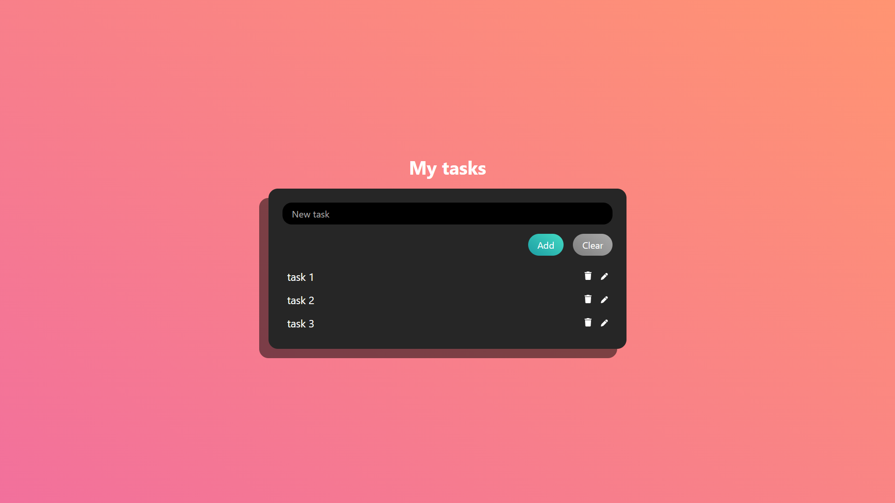
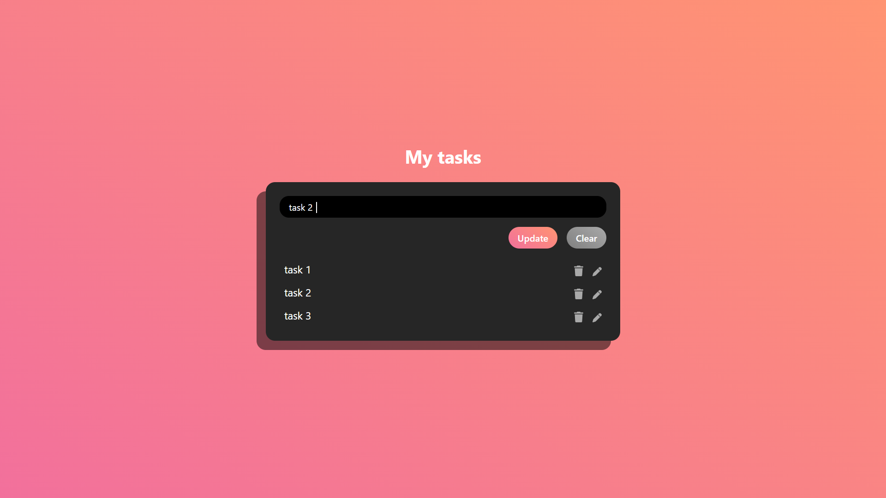

# todo-list

    Personal project | Dynamic to do list manager

<kbd></kbd>

> PROBLEMATIC

Develop a to do list app that is

    ✔ INTERACTIVE
    ✔ PERSISTIVE
    ✔ ADAPTATIVE
    ✔ EVOLUTIVE
    ✔ PERFORMANT

## Features

:heavy_plus_sign: ADD TASK

:pencil2: EDIT TASK

:arrows_counterclockwise: UPDATE TASK

:calendar: TIMESTAMP

:triangular_flag_on_post: PRIORIZE by level

:x: DELETE TASK

:heavy_check_mark: CLEAR LIST

## Skills developed

- [x] Global state management
- [x] Store / Display / Update data
- [x] Prevent useless re-renders
- [x] Render & styles based on state status
- [x] Graphic design without any UI template
- [x] Animations
- [x] Accessibility rules & customs
- [x] Custom user experience

## Add Task

<kbd></kbd>

## Update task

<kbd></kbd>
